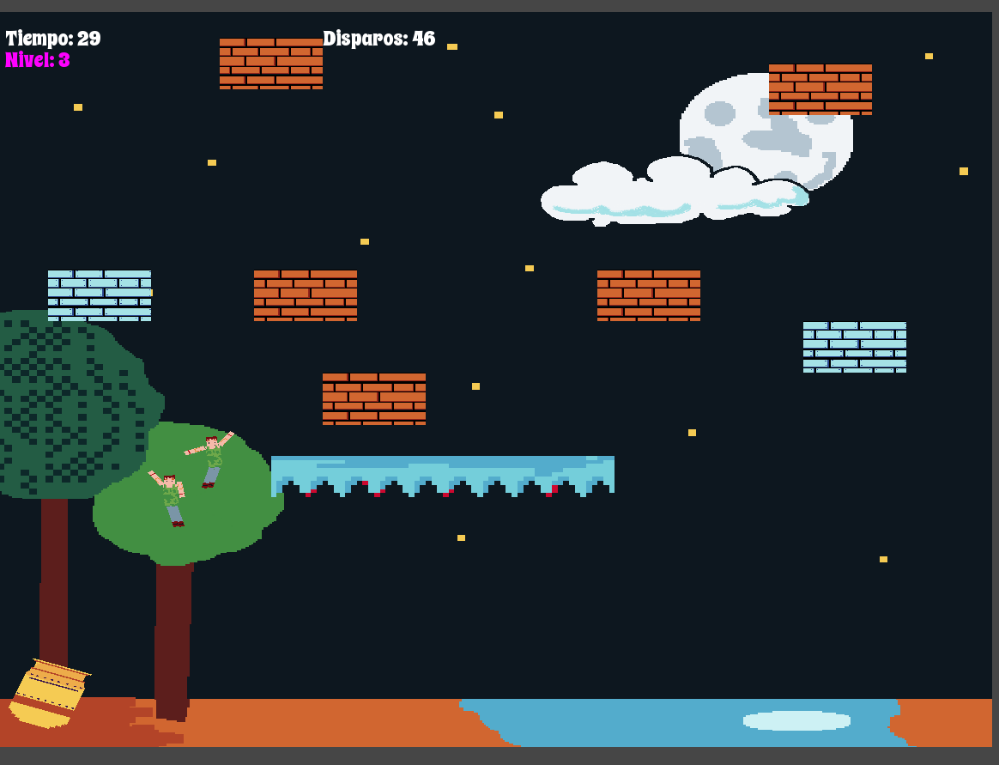
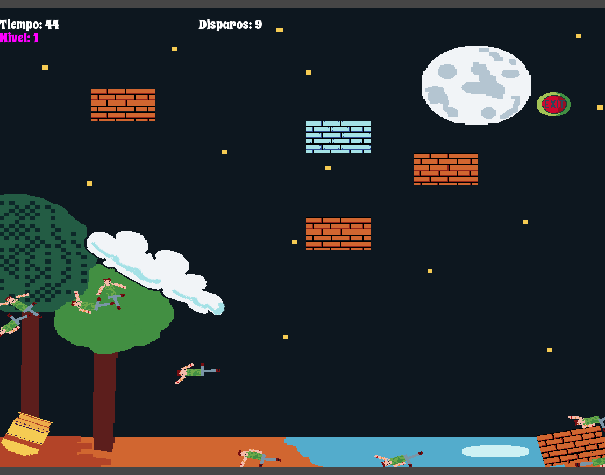

# Cannon Ragdoll Physics

Juego de física desarrollado en C++ utilizando SFML y Box2D.

El jugador dispara ragdolls desde un cañón con el objetivo de derribar estructuras y activar un interruptor para completar el nivel.

---

## Tecnologías Utilizadas

- C++
- SFML
- Box2D
- Visual Studio

---

## Descripción del Juego

El objetivo principal es:

- Disparar ragdolls utilizando un cañón
- Aprovechar la física para derribar obstáculos
- Encontrar y activar el interruptor para avanzar de nivel

El proyecto pone énfasis en el uso de físicas realistas mediante Box2D, manejo de colisiones, física de resortes y renderizado con SFML.

---

## Controles

- Click del mouse para disparar, dando dirección y potencia según su posición
- R: Reiniciar nivel
- Esc: Salir

---

## Capturas de Pantalla

  

  

---

## Descarga

El ejecutable se encuentra disponible en la sección "Releases" del repositorio.

---

## Autor

Lucas Boffa  
UNL – Tecnicatura en Diseño y Desarrollo de Videojuegos  
